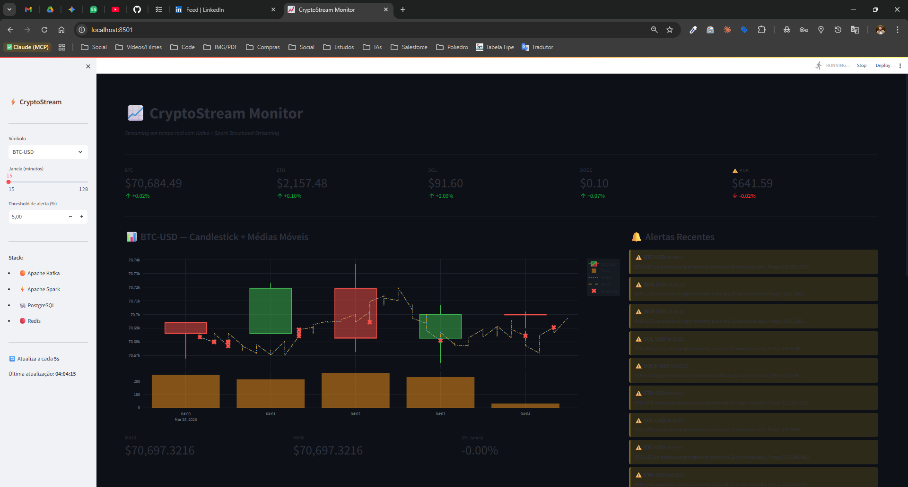

# 🚀 CryptoStream — Monitor de Criptomoedas em Tempo Real



> **Stack de streaming**: Kafka + Spark Structured Streaming + PostgreSQL + Redis + Streamlit

---

## 🏗️ Arquitetura

```
Coinbase WebSocket
       │
       ▼
┌─────────────┐
│   Producer  │  Python + confluent-kafka
│  (partição  │  Exactly-once | 5 símbolos | 5 partições
│  por ativo) │
└──────┬──────┘
       │  Kafka Topic: crypto-prices
       │  (5 partições, retenção 24h)
       ▼
┌──────────────┐
│    Kafka     │  confluent-kafka 7.5
│   Broker     │  Idempotência habilitada
└──────┬───────┘
       │
       ▼
┌──────────────────┐
│  Spark Streaming │  Spark 3.5 Structured Streaming
│                  │  • Sliding window 30s/10s
│  • Watermark 10s │  • Médias móveis (MA10, MA30)
│  • Z-score anomaly│  • Detecção de anomalias
│  • Checkpointing │  • Exactly-once via checkpoint
└──────┬───┬───────┘
       │   │
       ▼   ▼
  Postgres Redis
  (histórico) (cache ao vivo + pub/sub alertas)
       │   │
       └───┘
          │
          ▼
    ┌──────────┐
    │Streamlit │  Dashboard ao vivo
    │Dashboard │  Atualiza a cada 5s
    └──────────┘
```

---

## ⚡ Quick Start

### Pré-requisitos

- Docker Engine 24+
- Docker Compose v2
- 4GB RAM disponível

### Subir o projeto

```bash
make up
```

Aguarde ~30-60s e acesse:

| Serviço | URL |
|---------|-----|
| 📈 Dashboard | http://localhost:8501 |
| 🟠 Kafka UI | http://localhost:8080 |
| 🐘 PostgreSQL | `localhost:5432` |
| 🔴 Redis | `localhost:6379` |

### Outros comandos úteis

```bash
make logs           # Todos os logs em tempo real
make producer-logs  # Só o producer
make spark-logs     # Só o Spark
make kafka-topics   # Descreve o tópico com partições
make kafka-consumer # Consome 10 mensagens raw
make psql           # Shell PostgreSQL
make redis-cli      # Shell Redis
make down           # Para tudo
make clean          # Para e remove volumes
```

---

## 🎯 Diferenciais Técnicos

### 1. Exactly-Once Semantics

**Producer side:**
```python
Producer({
    "enable.idempotence": True,   # Sem duplicatas no broker
    "acks": "all",                # Confirmação de todos os replicas
    "retries": 10,
})
```

**Consumer side (Spark):**
- Checkpointing em HDFS/local garante reprocessamento sem duplicatas
- `outputMode("update")` com escrita idempotente (`ON CONFLICT DO NOTHING`)

### 2. Particionamento Inteligente

Cada criptomoeda → partição dedicada:
```
BTC-USD → partição 0
ETH-USD → partição 1
SOL-USD → partição 2
DOGE-USD → partição 3
BNB-USD → partição 4
```

Isso permite **consumer groups** processar moedas em paralelo independente.

### 3. Sliding Windows + Watermark

```python
parsed_df
  .withWatermark("event_time", "10 seconds")  # Tolera late data
  .groupBy(
      F.col("symbol"),
      F.window("event_time", "30 seconds", "10 seconds")  # 30s window, 10s slide
  )
```

### 4. Detecção de Anomalias por Z-Score

```python
# Anomalia: desvio > 2 sigma em relação à MA10
.withColumn("is_anomaly",
    F.when(
        F.abs(avg_price - ma10) > 2 * std_dev,
        F.lit(True)
    ).otherwise(F.lit(False))
)
```

### 5. Redis como Cache + Pub/Sub

- `HSET crypto:latest:BTC-USD` → estado mais recente (TTL 5min)
- `PUBLISH crypto:alerts` → alertas em tempo real para o dashboard

---

## 📊 Queries úteis no PostgreSQL

```sql
-- Candlestick dos últimos 30 minutos
SELECT * FROM candlestick_1min
WHERE symbol = 'BTC-USD'
  AND candle_time > NOW() - INTERVAL '30 minutes';

-- Anomalias detectadas hoje
SELECT symbol, window_start, avg_price, std_dev
FROM crypto_metrics
WHERE is_anomaly = TRUE
  AND window_start > NOW() - INTERVAL '24 hours';

-- Alertas por tipo
SELECT alert_type, COUNT(*) as qtd, AVG(change_pct) as avg_change
FROM crypto_alerts
GROUP BY alert_type;

-- Velocidade de ingestão
SELECT
  date_trunc('minute', ingested_at) as minuto,
  COUNT(*) as eventos
FROM crypto_prices
WHERE ingested_at > NOW() - INTERVAL '10 minutes'
GROUP BY 1 ORDER BY 1;
```

---

## 🔧 Variáveis de Ambiente

| Variável | Padrão | Descrição |
|----------|--------|-----------|
| `SYMBOLS` | `BTC-USD,ETH-USD,...` | Pares de criptomoedas |
| `ALERT_THRESHOLD_PCT` | `2.0` | % de variação para disparar alerta |
| `KAFKA_TOPIC` | `crypto-prices` | Nome do tópico |
| `REDIS_HOST` | `redis` | Host do Redis |

---

## 🗂️ Estrutura do Projeto

```
crypto-stream/
├── docker-compose.yml          # Orquestração de todos os serviços
├── Makefile                    # Comandos de conveniência
├── producer/
│   ├── Dockerfile
│   ├── requirements.txt
│   └── producer.py             # WebSocket → Kafka (exactly-once)
├── spark_processor/
│   ├── Dockerfile
│   └── processor.py            # Spark Structured Streaming
├── dashboard/
│   ├── Dockerfile
│   ├── requirements.txt
│   └── dashboard.py            # Streamlit ao vivo
├── postgres/
│   └── init.sql                # Schema + views de candlestick
└── README.md
```

---

## 💡 Extensões Sugeridas

- [ ] Substituir Spark por **Apache Flink** (menor latência)
- [ ] Adicionar **Schema Registry** (Confluent) + Avro
- [ ] Implementar **dead letter queue** para mensagens com erro
- [ ] Exportar métricas para **Prometheus + Grafana**
- [ ] Adicionar modelo de ML para predição de preços

---

*Projeto de portfólio demonstrando streaming de dados em produção com padrões enterprise.*
